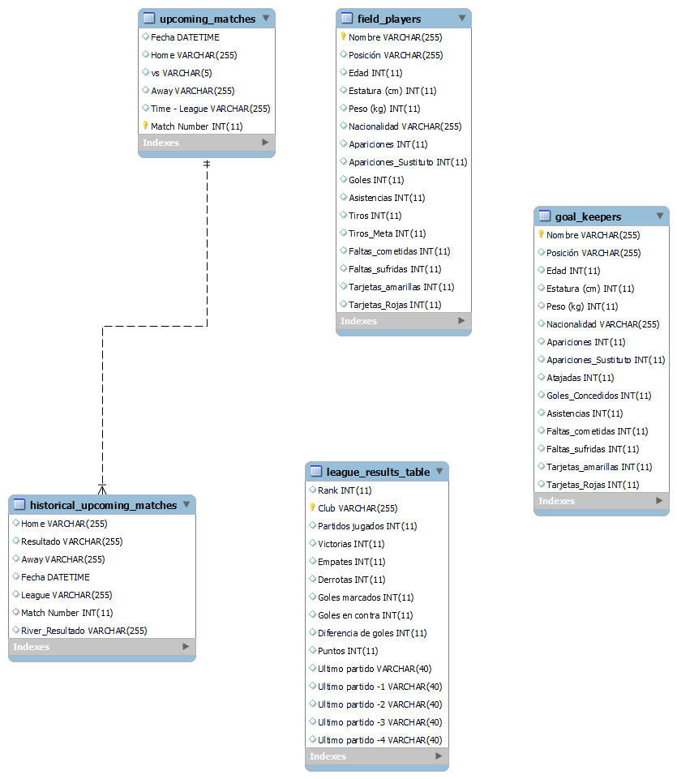
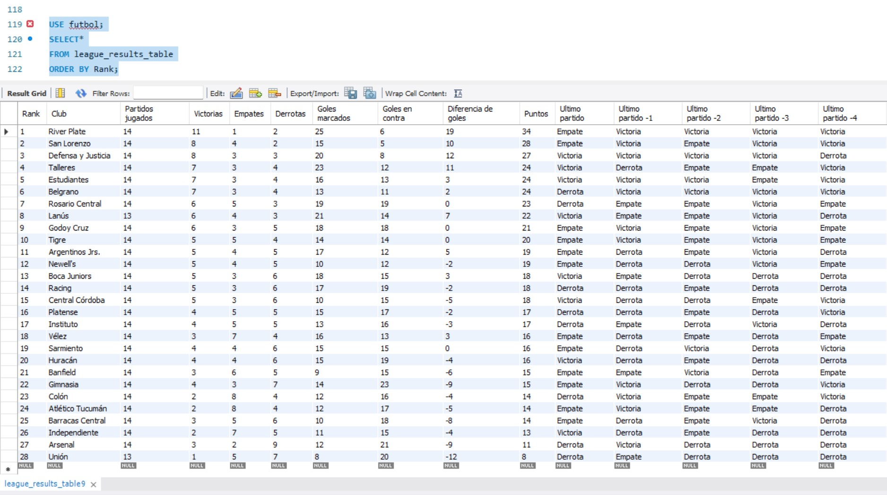
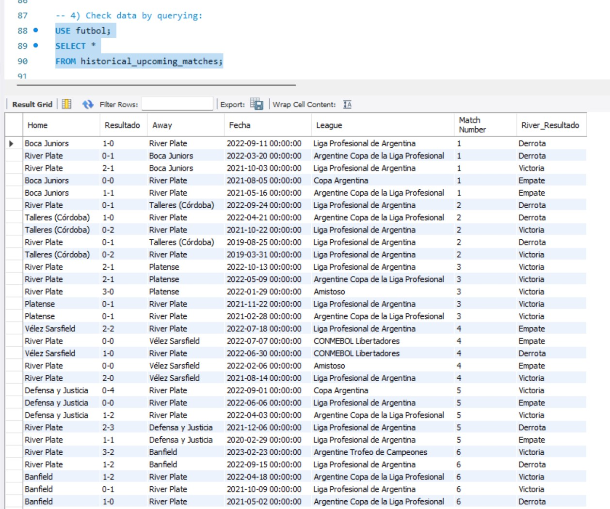
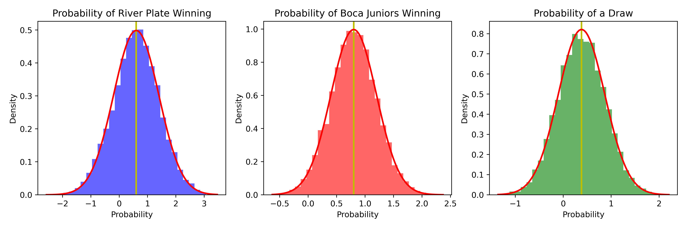
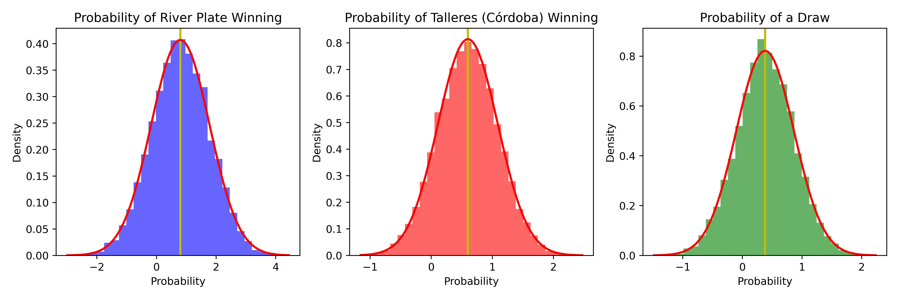
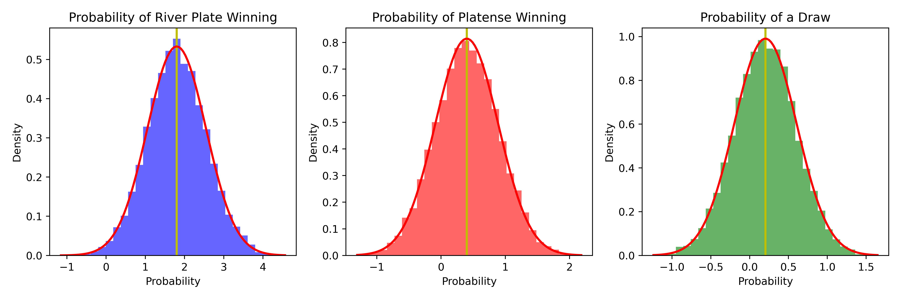
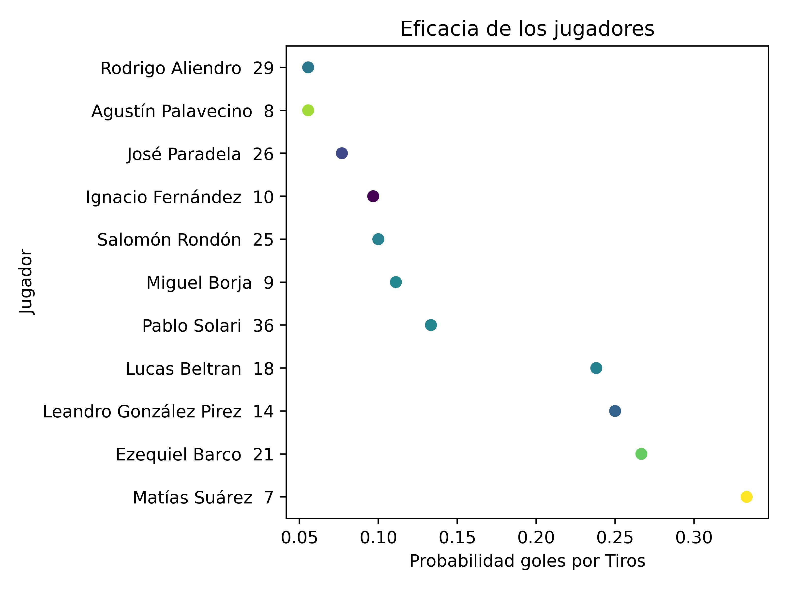
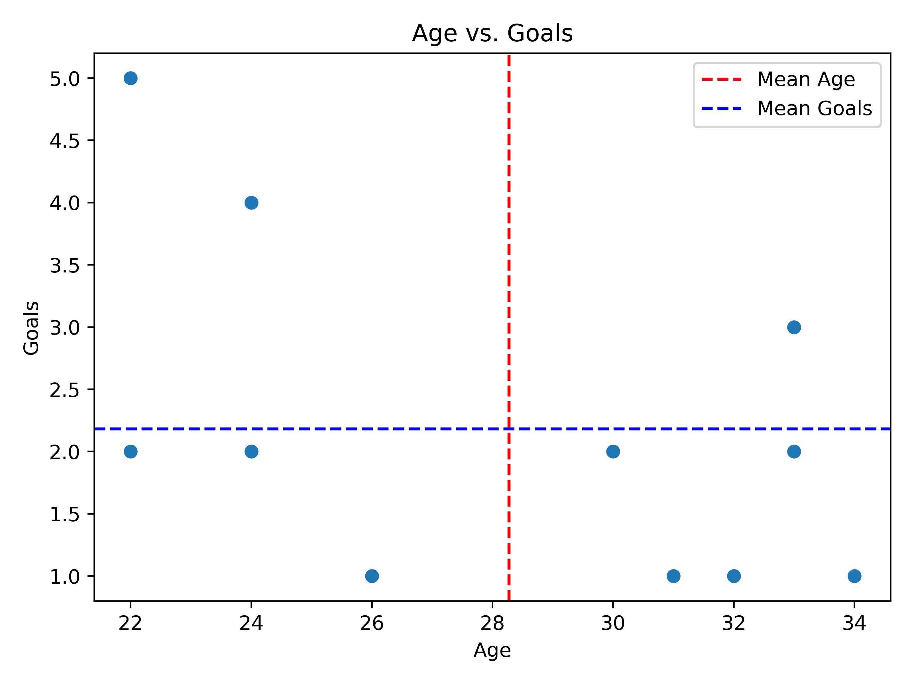
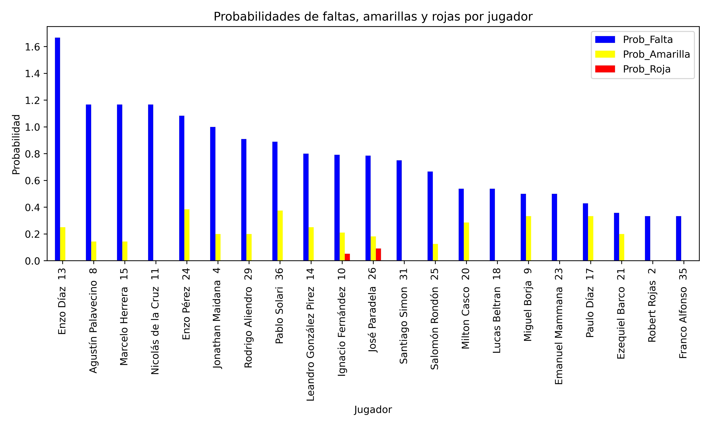

# Project 3 - Pipeline Project - eda-etl-pipeline
---
---

<p align="center">
    
</p>

---
---

The purpose of this project is to combine the data cleansing techniques learnt in Module 1, together with extraction techniques (API and WebScrapping) together with visualization and SQL, as well as modularization and encapsulation.

The topic selected for this project aimed to understand which is the current standing of "River Plate" (a soccer team from Argentina) in the Argentinean First Devision League and what would be the probabilities of winning some of the upcoming games as well as having a view of the team players performances in some aspects (goal effectiveness, fouls ratio, etc).


<p align="center">
    
</p>

---
---
##  Table of Content:
   #### 1. Organization of the repo/project
   #### 2. Hypothesis of this project
   #### 3. Data
   #### 4. Visualizations
   #### 5. Conclusions
   #### 6. Links and Resources

***
### 1. Organization of the repo/project
***
```python
/data
    field_players{date_of_scrape}.csv
    goal_keepers{date_of_scrape}.csv
    historical_upcoming_{date_of_scrape}.csv
    league_results_table_{date_of_scrape}.csv
    upcoming_matches_{date_of_scrape}.csv
/images
    eficacie_graph.jpg
    faltas_graph.jpg
    goals_age_graph.jpg
    match_1_graph.jpg
    match_2_graph.jpg
    match_3_graph.jpg
/notebooks
    Proyecto 3 - Statistics.ipynb
/SQL
    Futbol_Database_Scheme.png
    futbol_workbench_model.mwb
    SQL_Check_Data_from_table-All_upcoming_matches.png
    SQL_Query_with_Joins-River_vs_Boca_upcoming.png
    SQL_Query_with_Temporary_Tables-River_Wins_Home_vs_Away.png
    SQL_historical_results_table.jpg
    SQL_league_results_table.jpg
    SQL_futbol_DB.sql
/src
    cleaning.py
    graphics.py
    scraping.py
    sql_upload.py
.gitignore
README.md
```
***
### 2. Hypothesis of this project
***
#### Hypothesis --> Understand which is the current ranking situation of River Plate in the Argetntinean First Divition League.

   ##### a) What is the current league winning probability for River Plate based on the latest results?
   ##### b) What is the probability of winning each of the 3 upcoming matches?
   ##### c) Which of the players has the highest scoring effectiveness (highest probability of scoring a goal)?
   ##### d) Is there any correlation between age and the number of scores in the team? Are only young players scoring? Which is the mean of both variables?
   ##### e) Which are the riskiest players for the upcoming matches based on the number of yellow and red cards? Who is the most likely player to make a foul in a match?


***
### 3. Data Pipeline Explanation:
***
The pipeline of this project had the following phases:
1) Extraction: For the data collection I have used several libraries such as Selenium, Requests and BeautifulSoup. The main websites used were Google and ESPN website from Argentina.
2) Transformation: For this phase, once the data was already scraped from each website, the data cleasing was performed in python using Pandas and Numpy libraries mainly. 
3) Loading: Once the data was prepared and ready for analysis, a CSV file for each table was created and saved as a buckup of the information scraped for easier recovery. On the other side, the main idea of this project was to upload the tables to SQL using pymysql, sqlalchemy and getpass libraries. 
4) Analysis/Reporting: On this final step, I have used scipy library mainly to calculate diferent probaiblities methods like Poisson and Normal Distribution. For the visualization part, Matplotlib, Seaborn and PlotlyExpress were the main libraries used.

***
### 4. Reporting/Visualizations
***
1. View the Database relation and connection of each table in Futbol Scheme (MySQL):



2. Quering which is the current Rank of River plate in the League:



- We can clearly see that by the time this report was performed, River Plate was standing 1st with 11 Victories out of 14 match played, giving us a winning accuracy of 0.7857 (78.57%) which after applying a Poisson distribution to determine the probability of winning 1 match, gives us 0.3581 (35.81%).

3. By quering the upcoming histrical table, we can have a view of the latest results from past macthes to be able to determine the probaibiliy of beating them based on this histrical data:



The next upcoming match is the biggest classic matches in Argentina, River Plate vs Boca Juniors:




- After running a 10,000 times simulation on Poisson based on these historical results, we can determine the pobability of each team scoring and based on the outcome of those goals, the probability of each winning.

*Update: by the time this project was perfomed the match was not yet plated, but today we can confirm that River Plate won 1-0.*

4. Same simulation performed for the other 2 upcoming matches:
- Talleres (Córdoba) vs River Plate
- River Plate vs Platense





- In both cases, as well as in the 1st match previously visualized, we can see that the scoring probability is pretty close one to the other. In the 3rd match we can have a better estimation of a potential clear victory from River Plate (but no certanties as we should also consider many other variables, but focusing only at golas and results)

5. Players with the highest scoring effectiveness from River Plate:





- Even though Matias Suarez had a very little amout of games played this season (due to an injury) he is the most effective player with 1 goal scored out of 6 matches played.
On the other hand, in the second graph we can clearly see that most of the goles scored were made by younger players and the current age mean is 28.27 with a scoring mean of 2.18.

6. Identifying the liklihood of a player making a foul and the card conversion rate:



- We can clearly see that the most aggresive player is Enzo Díaz with the highest probability of making more than 1 foul in a game and with a 25% chance of receiving a yellow card. On the other hand, we cannot see any risk in particular for any player in terms of Red Card conversions (only 2 with a less than 9% chance).

***
### 5. Conclusions
***
Based on the hypothesis of this project and after analyzing the data and visualizing the results, we can conclude the following:
- River is standing 1st in the League with a great performance and good probabilities of winning matches.
- The next 3 upcoming matches will be tough and complicated, but there are good trends in the past and in the current results to have good hopes of winning.
- Even though Matias Suares is not fully recovered, in case he feels good to play, the probabiliy of him scoring a goal and achieving a positive outcome is quiet good these days.
- There are some players that will need to be extra careful in the upcoming matches and behave better to avoid furhter penalizations and potential bans for upcoming games (mainly Enzo Díaz).

<p align="center">
    
</p>

***
### 6. Links and Resources
***
- Data sources: 
1. Argentina First Division League (Google): https://www.google.com/search?q=river+plate&oq=river+plate&aqs=chrome.0.0i271j46i39j46i175i199i512j0i512l2j69i60j69i65l2.1209j1j7&sourceid=chrome&ie=UTF-8#sie=t;/m/037d7f;2;/m/04hpk1;st;fp;1;;;
2. River Plate Players (ESPN): https://www.espn.com.ar/futbol/equipo/plantel/_/id/16/arg.river_plate
3. River Plate - Calendar of upcoming and historical matches: https://www.espn.com.ar/futbol/equipo/calendario/_/id/16/arg.river_plate

- Library used:
    - https://numpy.org/doc/1.18/
    - https://pandas.pydata.org/
    - https://docs.python.org/3/library/functions.html
    - https://plotly.com/python/
    - https://matplotlib.org/
    - https://seaborn.pydata.org/
    - https://pandas.pydata.org/docs/
    - https://docs.scipy.org/doc/scipy/
    - https://docs.python.org/3/library/getpass.html
    - https://docs.sqlalchemy.org/en/20/
    - https://pymysql.readthedocs.io/en/latest/
